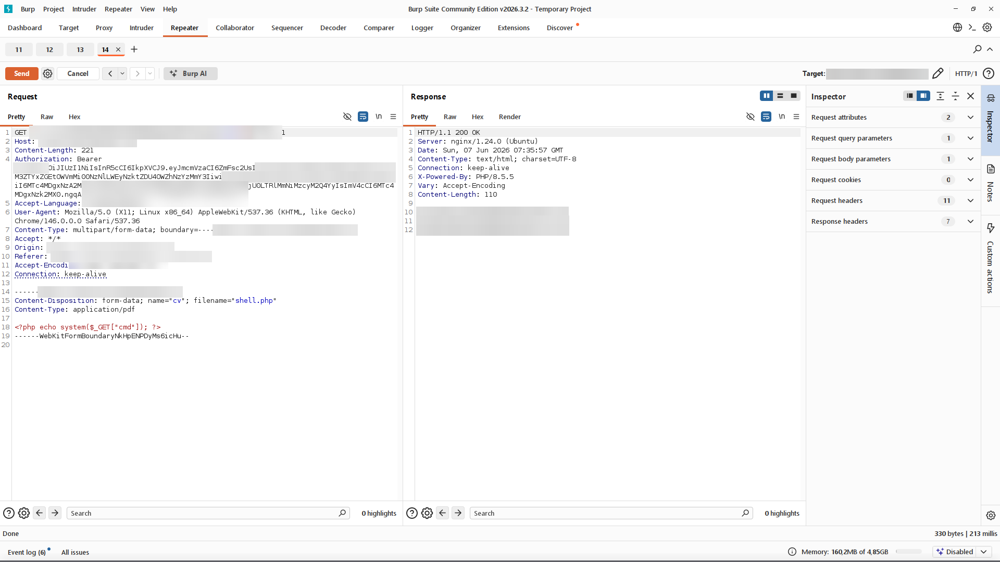
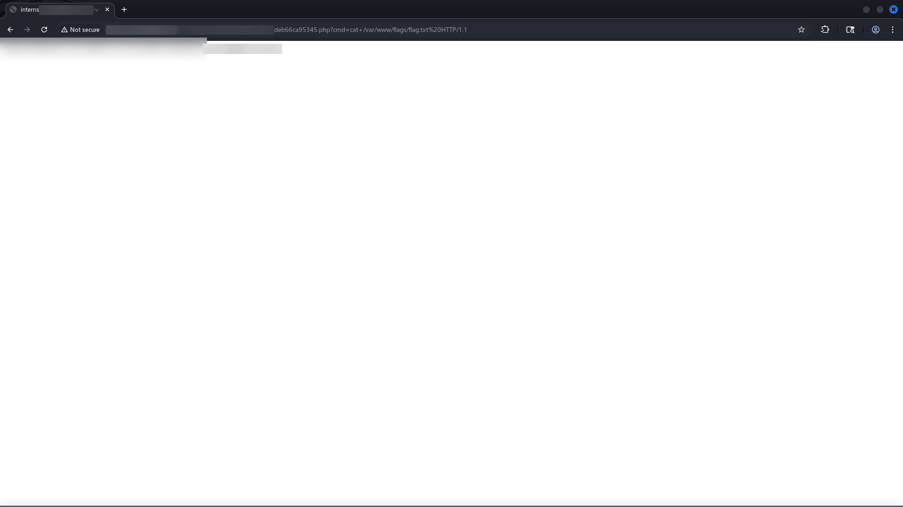
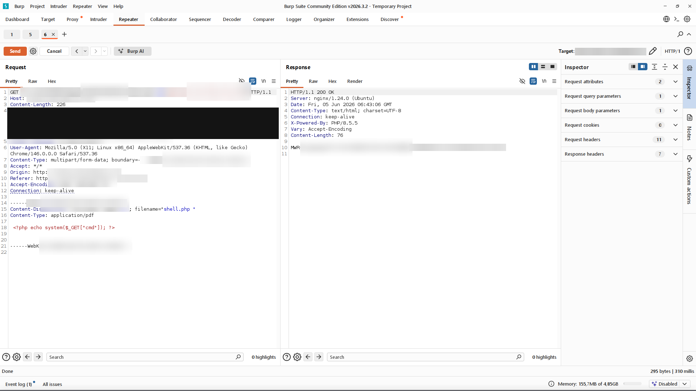

# Finding 1 — Unrestricted File Upload → Remote Code Execution

> Redacted evidence screenshots for this finding. Flag values, the target domain, credentials, tokens, and personal data are blurred. See the [full report](../../REPORT.md) for context.

### 1. Baseline CV upload accepted

### 2. Server returns 201 Created on upload

### 3. Profile API returns the stored file UUID

### 4. Uploaded file reachable at /cv-view/ with no auth

### 5. shell.php upload accepted with 201

### 6. Response headers include the X-Powered-By PHP version

### 7. Rce flag first read

### 8. Directory listing via the webshell

### 9. /etc/passwd read through the webshell

### 10. Listing of /var/www via the webshell

### 11. Rce flag browser

### 12. Rce flag value

