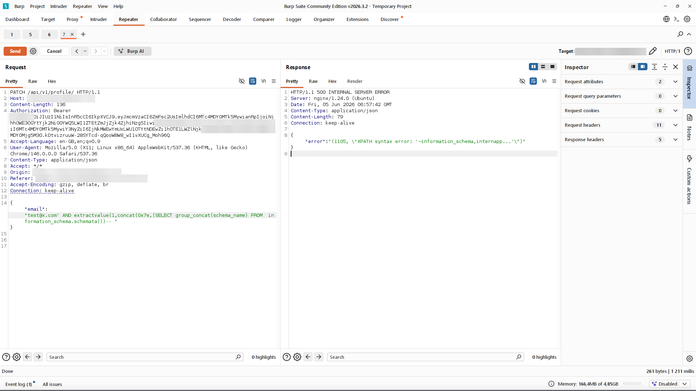
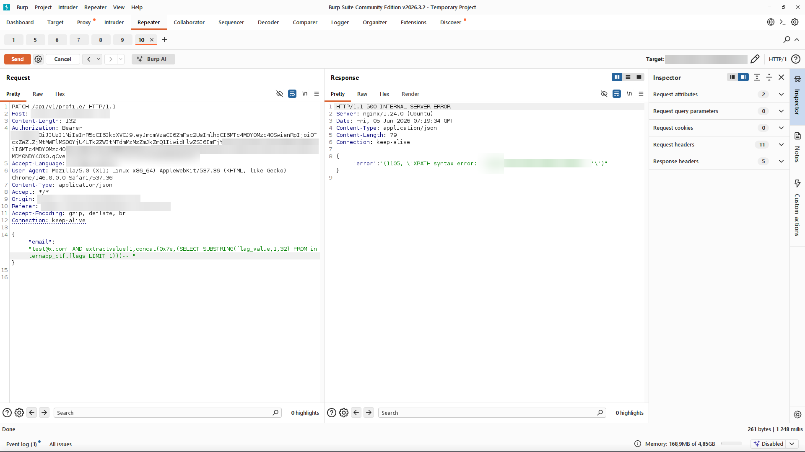
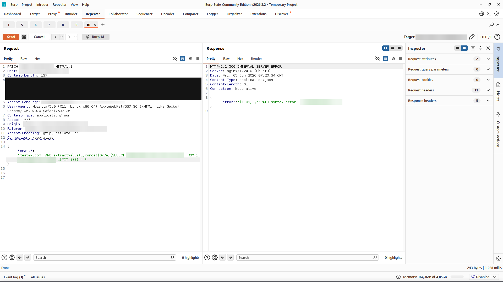

# Finding 2 - Error-Based SQL Injection

> Redacted evidence screenshots for this finding. Flag values, the target domain, credentials, tokens, and personal data are blurred. See the [full report](../../REPORT.md) for context.

### 1. Response shows nginx Server header and a raw MariaDB error

### 2. extractvalue leaks the MariaDB version

### 3. Schema enumeration via information_schema

### 4. Table enumeration in the active database

### 5. Sqli enum internapp ctf

### 6. Discovery of the users table

### 7. Discovery of the assignments table

### 8. Discovery of the user_answers table

### 9. Discovery of the cvs table

### 10. Discovery of the token_blocklist table

### 11. Sqli flag part1

### 12. Sqli flag part2

