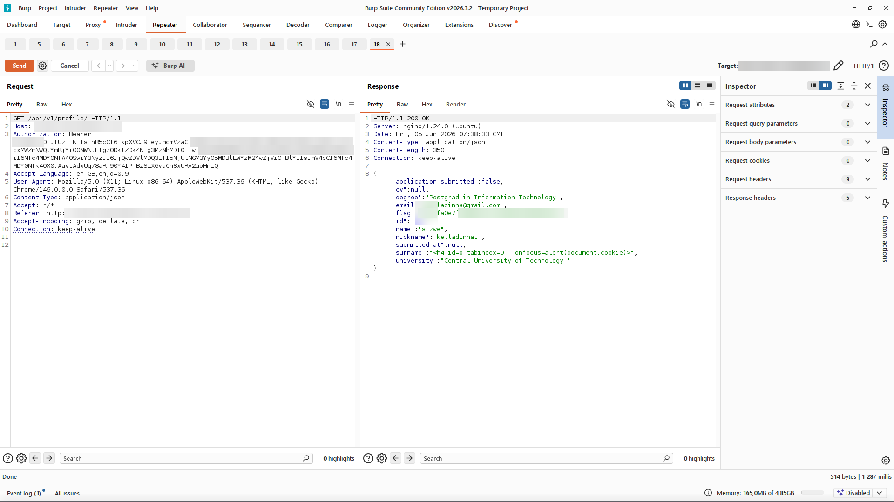

# Finding 4 - Stored Cross-Site Scripting

> Redacted evidence screenshots for this finding. Flag values, the target domain, credentials, tokens, and personal data are blurred. See the [full report](../../REPORT.md) for context.

### 1. Surname reflected unencoded; other fields entity-encoded

### 2. Baseline script-tag payload behaviour

### 3. h4 bypass payload accepted at registration with 201

### 4. Confirmation of the accepted payload

### 5. Payload returned unencoded in the profile API response

### 6. Xss h4 flag profile response

### 7. Stored payload rendered unencoded in the profile form

