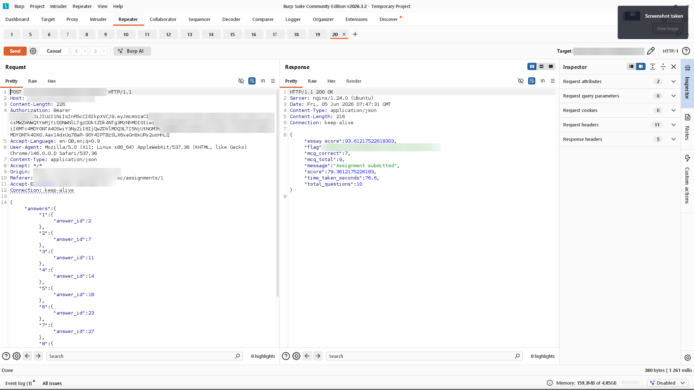
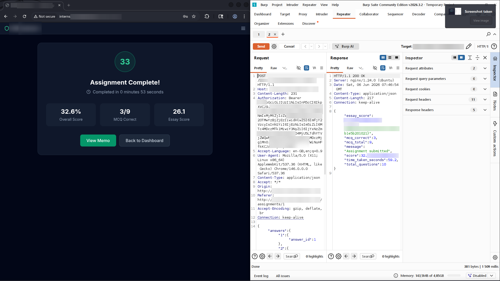

# Finding 5 — Assignment Logic Flaws

> Redacted evidence screenshots for this finding. Flag values, the target domain, credentials, tokens, and personal data are blurred. See the [full report](../../REPORT.md) for context.

### 1. Assignment dashboard before submission

### 2. Submission confirmation in the web UI

### 3. Assignment complete burp flag

### 4. Assignment complete flag burp 2

### 5. Start endpoint called again after completion

### 6. New submission issued, confirming unlimited retakes

