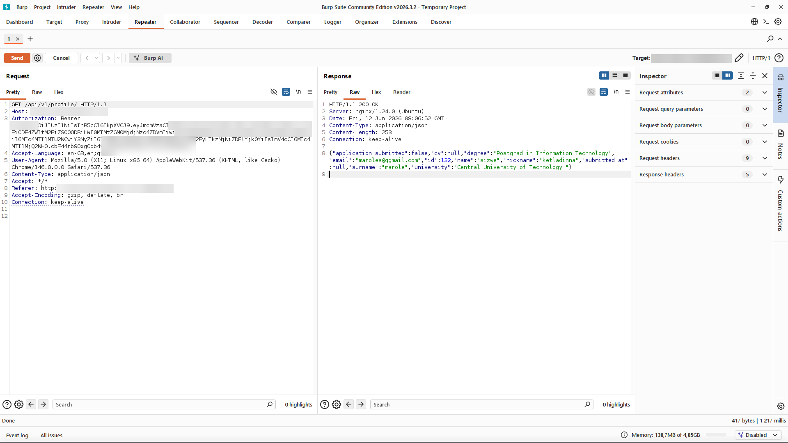

# Finding 9 — Missing HTTP Security Headers

> Redacted evidence screenshots for this finding. Flag values, the target domain, credentials, tokens, and personal data are blurred. See the [full report](../../REPORT.md) for context.

### 1. Login response shows none of the five security headers

### 2. Authenticated profile response returns the same minimal headers

