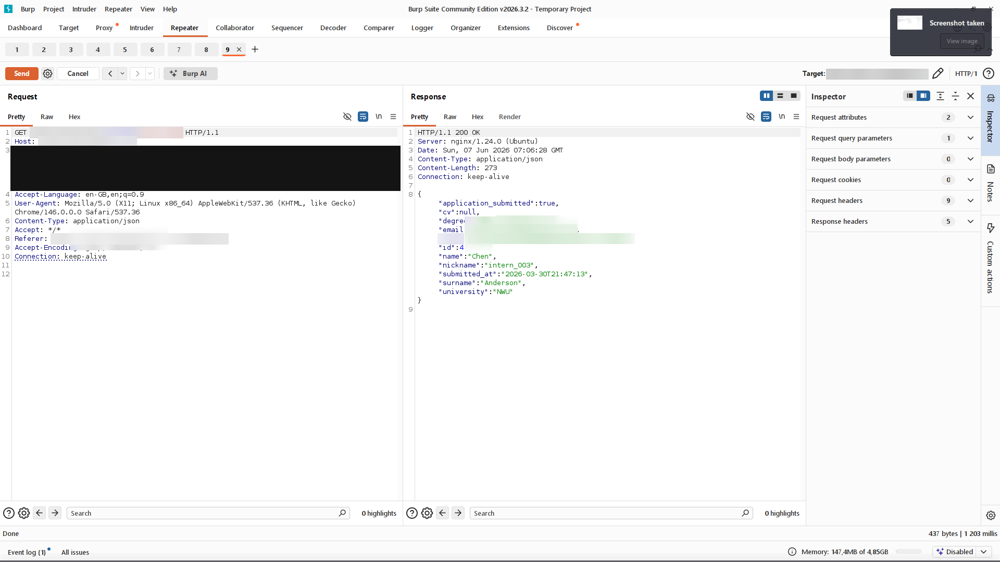
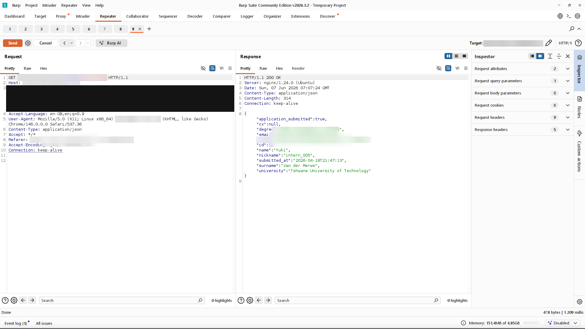
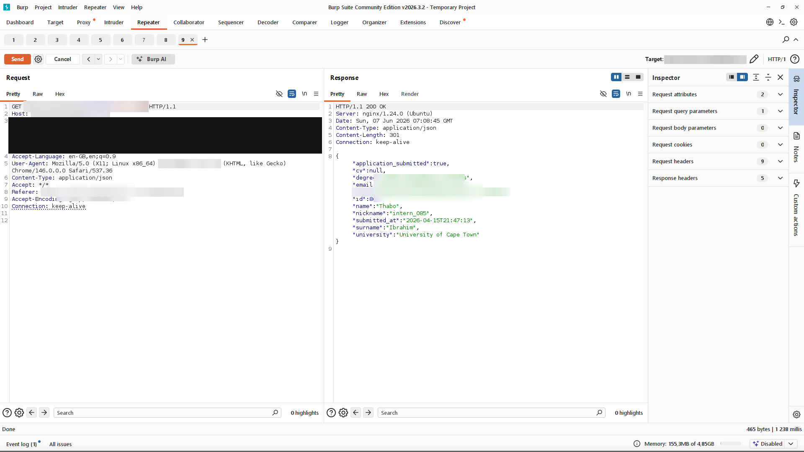

[← Back to overview](../README.md)

# Finding 3: Insecure Direct Object Reference - Unauthorised Access to Any Profile

**Severity:** High &nbsp;|&nbsp; **CVSS v3.1:** 6.5 (`AV:N/AC:L/PR:L/UI:N/S:U/C:H/I:N/A:N`) · engagement severity High
**CWE:** CWE-639 - Authorization Bypass Through User-Controlled Key
**OWASP Top 10 (2021):** A01:2021 Broken Access Control
**Proof captured:** Yes (marker value redacted)

## Description

The endpoint **GET /api/v1/profile/** accepts an optional **?nickname=**
parameter. When supplied, the server returns the matching profile without checking that the
caller is authorised to view it. Any valid user token can therefore read any user's profile,
including the admin account. The leaderboard endpoint returns every registered nickname,
providing a complete target list.

## Reproduction Steps

1. Log in as any user and obtain an access token.

   
   *__Figure 3.1__ - Leaderboard page listing user nicknames.*

   
   *__Figure 3.2__ - Leaderboard API response with full nickname list.*

2. Request another user's profile:

   ```http
   GET /api/v1/profile/?nickname=admin
   Authorization: Bearer <user_token>
   ```

3. The response returns that user's full profile, including **id**, email, and other
   personal fields, with no authorisation check.

   
   *__Figure 3.3__ - Privileged profile returned to an user token.*

   
   *__Figure 3.4__ - Another user's full profile retrieved.*

   
   *__Figure 3.5__ - A further user profile retrieved.*

   
   *__Figure 3.6__ - A further user profile retrieved.*

   
   *__Figure 3.7__ - Confirms the vulnerability scales across the user base.*

## Business Impact

The leaderboard lists the nicknames of all 120+ users, and any one can
be passed to **?nickname=** to read that user's name, email, university, degree, and CV
filename - using nothing more than a standard user token. The exposure covers every
registered user, not just the administrator account. The CV filenames returned here also feed
the unauthenticated download in Finding 1, so a profile read is enough to then retrieve each
candidate's actual documents. On its own, the disclosure of names, emails, universities, and
CV references across the user base is a POPIA concern: the missing access control releases
personal information without the safeguards Section 19 requires, separate from the file
download in Finding 1.

## Remediation

Remove the **?nickname=** parameter and always return the authenticated
user's own profile based on JWT claims. If lookups by nickname are genuinely required,
restrict them to admin accounts behind an explicit server-side permission check. Apply the
same server-side ownership check to every endpoint that returns object-scoped data.

---

[← Finding 2](02-sql-injection.md) &nbsp;|&nbsp; [Back to overview](../README.md) &nbsp;|&nbsp; [Next: Finding 4 - Stored XSS →](04-stored-xss.md)
