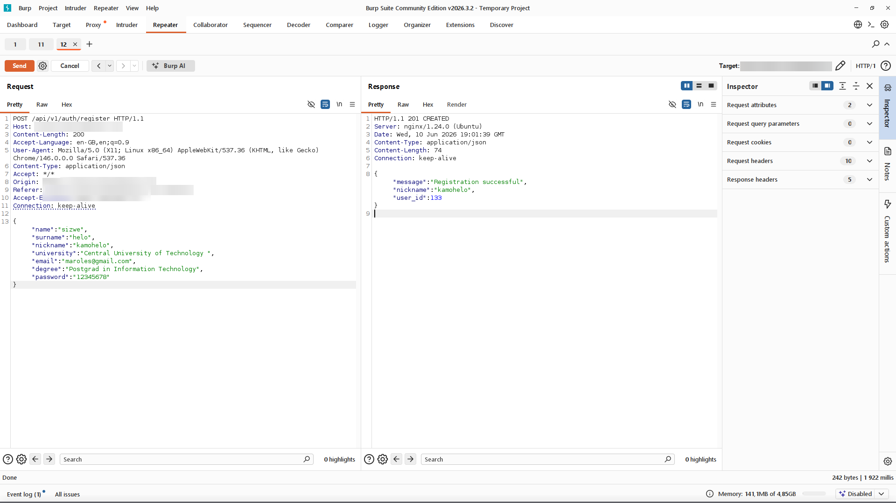

[← Back to overview](../README.md)

# Finding 7: Weak Password Policy

**Severity:** Low &nbsp;|&nbsp; **CVSS v3.1:** 3.7 (`AV:N/AC:H/PR:N/UI:N/S:U/C:L/I:N/A:N`)
**CWE:** CWE-521 - Weak Password Requirements
**OWASP Top 10 (2021):** A07:2021 Identification and Authentication Failures
**Proof captured:** N/A

## Description

Registration **POST /api/v1/auth/register** enforces a minimum length of eight
characters but no complexity. An all-numeric eight-digit password was accepted with no requirement
for mixed character classes and no rejection of trivially weak values.

## Reproduction Steps

1. Register with **"password": "12345678"**.
2. The server returns **201 Created**. The all-numeric password is accepted.

   
   *__Figure 7.1__ - Eight-digit numeric password accepted with 201 Created.*

## Business Impact

The SQL injection in Finding 2 exposes bcrypt hashes for all users. Weak
passwords crack quickly offline, after which an attacker can log in directly with the recovered
credentials. The admin hash is subject to the same risk.

## Remediation

Add complexity rules to the existing length check (upper, lower, digit, special),
enforced server-side. Optionally reject breached passwords via the HaveIBeenPwned k-anonymity API.

---

[← Finding 6](06-jwt-refresh-token.md) &nbsp;|&nbsp; [Back to overview](../README.md) &nbsp;|&nbsp; [Next: Finding 8 - No Rate Limiting →](08-no-rate-limiting.md)
