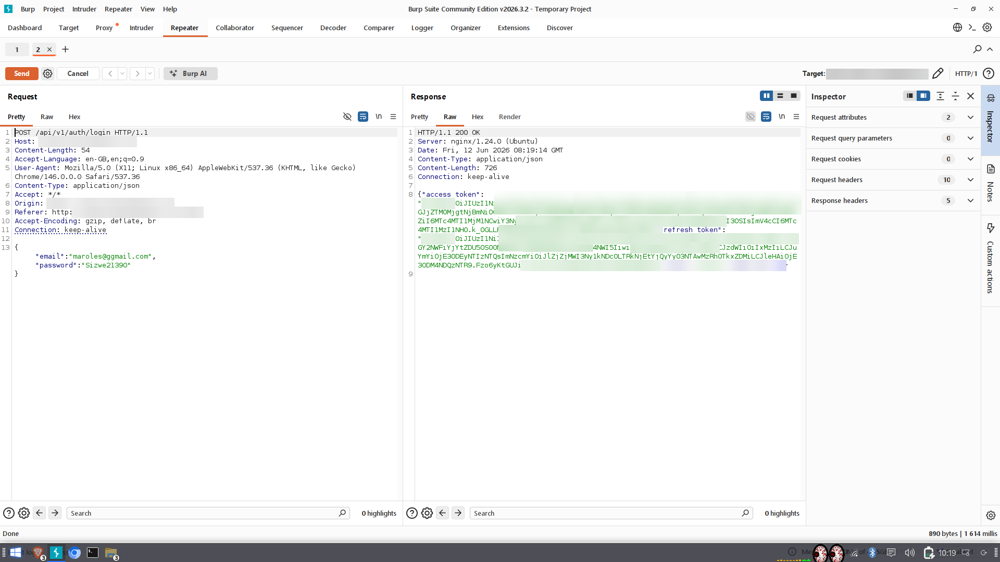
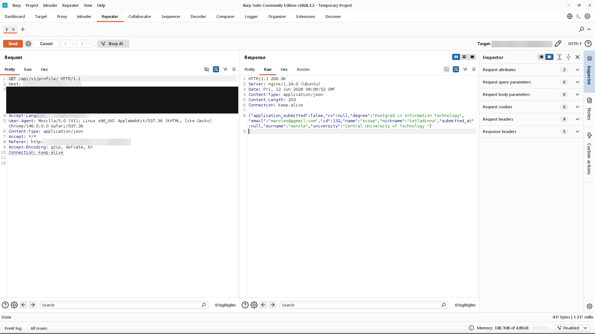

[← Back to overview](../README.md)

# Finding 10: Missing HTTP Security Headers

**Severity:** Low &nbsp;|&nbsp; **CVSS v3.1:** 4.3 (`AV:N/AC:L/PR:N/UI:R/S:U/C:L/I:N/A:N`)
**CWE:** CWE-693 - Protection Mechanism Failure · CWE-1021 - Improper Restriction of Rendered UI Layers
**OWASP Top 10 (2021):** A05:2021 Security Misconfiguration
**Proof captured:** N/A

## Description

Responses omit several standard security headers: **Content-Security-Policy**,
**X-Frame-Options**, **X-Content-Type-Options**, **Referrer-Policy**, and **Permissions-Policy**.
Their absence removes browser-side defences that would limit the impact of other issues such as the
stored XSS in Finding 4.

## Reproduction Steps

1. Send any request, for example **GET /**, and inspect the response headers in Burp Suite or DevTools.
2. None of the listed security headers are present.

   
   *__Figure 10.1__ - Login response shows none of the five security headers.*

   
   *__Figure 10.2__ - Authenticated profile response returns the same minimal headers.*

## Business Impact

Without a Content-Security-Policy, the stored XSS in Finding 4 runs with no
browser-enforced restriction. Without X-Frame-Options the app can be framed for clickjacking, and
without X-Content-Type-Options browsers may MIME-sniff responses. These are defence-in-depth controls
rather than direct vulnerabilities.

## Remediation

Add the headers at the nginx layer so they apply to all responses:

```nginx
add_header X-Content-Type-Options "nosniff" always;
add_header X-Frame-Options "DENY" always;
add_header Referrer-Policy "no-referrer" always;
add_header Content-Security-Policy "default-src 'self'" always;
add_header Permissions-Policy "geolocation=(), microphone=()" always;
```

Refine the Content-Security-Policy to match the application's real script and resource sources before deployment.

---

[← Finding 9](09-user-enumeration.md) &nbsp;|&nbsp; [Back to overview](../README.md) &nbsp;|&nbsp; [Next: Finding 11 - Information Disclosure →](11-information-disclosure.md)
